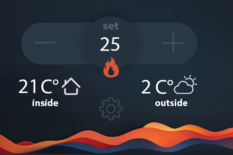

# Tasmota thermostat

This is simple thermostat specifically for the SonOFF NSPanel **not the pro version**. It is based on the Tasmota firmware and uses the built-in temperature sensor and relay to control the temperature in a room.

## Features

- Set the desired temperature
- control the relay to turn on/off the heater (L1)
- Display local outside temperature fetched from open-meteo.com



## Installation

You need to install tasmota on the device first.

Video tutorial: [https://www.youtube.com/watch?v=sCrdiCzxMOQ](https://www.youtube.com/watch?v=sCrdiCzxMOQ)

2. Upload the autoexec.be file found in this repository. You can start a webserver with the following command if you have python3 installed:

```bash
python3 -m http.server
```

Then just note the IP address and port number and use it in the following command into the tasomta console:
Note that you need to check the variables in autoexec.be and adjust them to your needs, for example the location of the outside temperature. You can re-upload the file after changing it.

```bash
Backlog UrlFetch http://192.168.1.6:8000/autoexec.be; Restart 1
```

After reboot, use the following to flash the display in the console:
    
```bash

FlashNextion http://192.168.1.6:8000/nsx.tft
```
